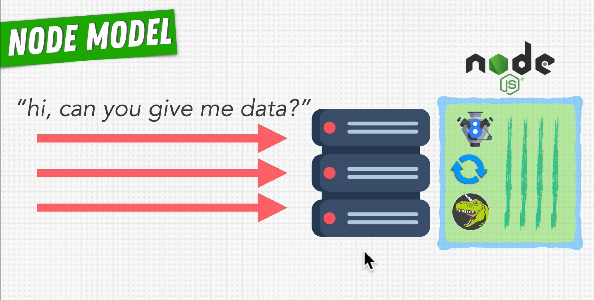

### Nodejs is a JavaScript runtime


### Libuv has 4 threads available

Libuv uses OS(kernal) directly when possible (most async operations), others run using thread in thread pool


# Event Loop

written in C++, working like below:

```js
while(!shouldExit) {
	processEvents();
}
```


# Callback Queue

Each async function has a callback function to be added to the Callback Queue when finish executed. These "callback" functions will be executed one by one.


There are several Callback Queues in each phases of Event Loop:


There are three timers in NodeJS: `setTimer()`, `setInterval()` and `setImmediate()`

One cycle of the event loop:


Callback function of `SetImmediate()` will run immediate after event loop finish check I/O callbacks BEFORE next cycle of event loop.

There are other phases of event loop like idol and prepare phase, but JS cannot do anything with them, so they are not important.

# Node vs JavaScript


# Node vs php and python

Server like Apache is model of blocking, it will create thread for each request.


Node is model of non-blocking I/O:



# Pros and Cons

## Pros

* Node sends work to OS through JS engine, OS communicates CPU in a lowest level (machine code), CPU will delegate tasks to devices like graphic card or hard discs.

* Good when use on servers, talking to databases or coordinating with other servers.

* Good at serving data for I/O heavy applications. i.e. video streaming (Netflix)


## Cons

* Not good at video processing or machine learning, these are blocking processor heavy computations.

* If code blocks in JS or using CPU heavily, event loop will get stuck. Node won't be able to manage other tasks efficiently.

# Observer Pattern & Node Event Emitter


```js
const EventEmitter = require('events')
const celebrity = new EventEmitter();

// Subscribe to celebrity for Observer 1
celebrity.on('race', (result) => {
  result === 'win' && console.log('Congratulations! You are the best!');
});

// Subscribe to celebrity for Observer 2
celebrity.on('race', (result) => {
  result === 'win' && console.log('Boo I could have better than that!');
});

celebrity.emit('race', 'win');
celebrity.emit('race', 'lost');
```

process is an instance of EventEmitter

```js
//param: code, 0 for successful execution with no errors
process.on('exit', (code) => {
	console.log('Process exit event with code: ', code)
});
```

# Node Modules

```js
const { request } = require('http');//or require('https') to use https

const req = request('http://www.google.com', (res) => {
  res.on('data', (chunk) => {
    console.log(`Data chunk: ${chunk}`);
  });
  res.on('end', () => {
    console.log('No more data')
  })
})

req.end();

//or

const { get } = require('http');//or require('https')

get('http://www.google.com', (res) => {
  res.on('data', (chunk) => {
    console.log(`Data chunk: ${chunk}`);
  });
  res.on('end', () => {
    console.log('No more data')
  })
})
```


modules we dont need to add extensions when import, such as `require('./index')` . Node will try to find `index.js`, if not exist, try find `index.json` then `index.node`


Other modules we have to add extensions. such as `require('./foo.jsx')`

# CommonJS Module vs ECMAScript Module

#### CommonJS Module (most of module are written in this):

#### code.js

```js
const foo = require('./foo');
const bar = () => {}
module.export = { bar }
```

#### ECMAScript (ES6) Module:

Note: use extension `.mjs` to enable ES6 module, and imported file's extension is always necessary

#### code.mjs

```js
import foo from './foo.mjs';// DO NOT omit .mjs extension
const bar = () => {}
export {
	bar
}
```

# Module Caching

```js
const { foo } = require ('./someFile');
const { bar } = require ('./someFile');
//Node will cash the file so that the code will not be imported repeatly
```

`console.log(require.cache)` to see which module has been cached and which has been loaded


# npm

Package, a collection of modules

`npm init -y` 

-y: say yes to all init questions

`npm install`

--save: for production

--save-dev: for development

-g: globally in machine to use anywhere

Note: If modules not installed globally, the executable file will be in `./node_modules/.bin` folder. i.e. in terminal, run `./node_modules/.bin/nodemon app.js`


## Semantic Versioning

Given a version number MAJOR.MINOR.PATCH, increment the:

1. MAJOR version when you make incompatible API changes,
2. MINOR version when you add functionality in a backwards compatible manner, and
3. PATCH version when you make backwards compatible bug fixes.

Additional labels for pre-release and build metadata are available as extensions to the MAJOR.MINOR.PATCH format.

## package-lock.json

Specify the detailed origin source of package we are using, include version, where download from, hash integrity, dependencies etc.

`^`symbol means automatically update the version to the latest version by rules:

1. If major version is 0, update to the latest patch version of current minor version. i.e. ^0.8.0 will update to 0.8.1, will not update to 1.2.0 or 0.9.2. To apply the same rule for major version > 0, we can use `~`symble. i.e. ~1.8.0 will update to 1.8.1, will not update to 2.2.0 or 1.9.2

1. If major version >= 1, update to the latest minor version of current major version. i.e. ^1.8.0 will update to 1.9.3, will not update to 2.2.0

## Vulnerabilities In Dependencies

`npm audit` to check vulnerabilities

`npm audit fix` to fix vulnerabilities

# nvm

Node Version Manager, is a bash script used to manage multiple released Node.js versions.

`nvm use 8` to use node version 8

# REPL

When type `node` without arguments, it will enter repl mode.

Read => Eval(Evaluation) => Print => Loop

# Nodemon

Nodemon can automatically restarting the node application when file changes in the directory are detected.

`npm install nodemon --save-dev`

change `"scripts":{"dev":"nodemon app.js"}` then `npm run dev`

# Testing


`npm install --save-dev jest`

## API testing

`npm install --save-dev supertest`

```js
const request = require('supertest')
const app = require('../../app')//app is express app that listening

describe('Test GET /launches', () => {
    test('It should respond with 200 success', async () => {
        const response = await request(app)
        .get('/launches')
        .expect('Content-Type', /json/)
        .expect(200)
    })
})
})
```

